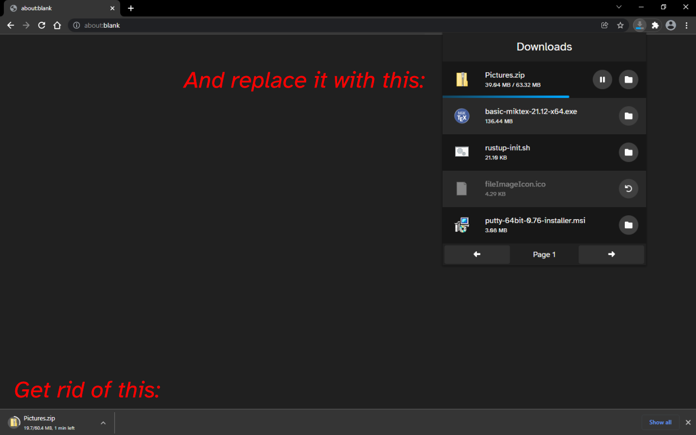
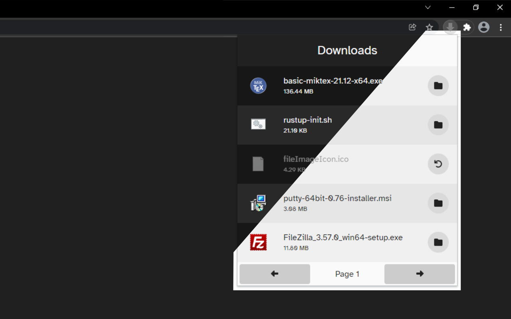

# Download-box

*Download-box* is a Chrome extension that gets rid of the ugly shelf that Chrome
somehow still uses. It gives you a modern drop-down to view your current and
past downloads, with things like shortcuts to show their folder locations.

This extension is intended to be a replacement to *Downloads: Your Downloads
Box*, which was removed from the Chrome store some time ago. It comes with a few
updates like pagination.

Both light and dark mode are supported:

Bug reports and feature requests are welcome in the [issues
tab](https://github.com/matthew-e-brown/download-box/issues). Because I
personally use this extension, you can trust that I care about keeping it
maintained.